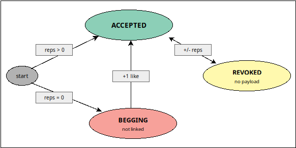

# Freechains: Guide

[
    [Basics](#basics)                   |
    [Synchronization](#synchronization) |
    [Reputation](#reputation)           |
    [Consensus](#consensus)             |
    [Hard Forks](#hard-forks)           |
    [Moderation](#moderation)
]

The command-line [API](cli.md) of Freechains is straightforward:

```
freechains chains add ...           # create or clone chain locally
freechains chain post ...           # post to chain
freechains chain list ...           # list actions
freechains chain (dis)like ...      # rate action or author
freechains chain (un)revoke ...     # remove or restore payload
freechains chain reps ...           # query reputation
freechains chain sync ...           # synchronize with remote peer
freechains chain abandon ...        # drop history branch
freechains chain sweep              # erase revoked payloads
```

<!--
For testing purposes, you may prepend an alternative path to store the chains:

```
freechains --root=/tmp/tests/ ...
```
-->

# Basics

To operate on the chains, `Alice` first needs to create an SSH keypair:

```
$ ssh-keygen -t ed25519 -C '' -f /tmp/alice
```

`Alice` can now create a chain `/chat` locally:

```
$ freechains chains add /chat init --pioneer=/tmp/alice
461cfb4...
```

This creates the chain with `Alice` as the sole pioneer.
The output is the chain identifier, unique across all peers.

A chain is backed by a Git repository, with an independent commit history.

Note that most identifiers depend on local creation time and thus will differ
throughout this guide.

All application data resides in `~/.freechains/`:

```
$ ls ~/.freechains/chains/
```

With the chain set, we can now post some content:

```
$ freechains chain /chat post inline $'Hello World\n' --sign=/tmp/alice
b52c62f...
$ freechains chain /chat post inline $'I am here\n'   --sign=/tmp/alice
d6568e4...
```

The output is the unique identifier of each post.

We can list all posts in the chain...

- ...as a DAG:

```
$ freechains chain /chat list dag
b52c62f       # 'Hello World'
   |
d6568e4       # 'I am here'
```

- ...or in consensus order:

```
$ freechains chain /chat list order
b52c62f...    # 'Hello World'
d6568e4...    # 'I am here'
```

We can also query each action individually:

- Post payload:

```
$ freechains chain /chat get payload b52c62f
Hello World
$ freechains chain /chat get payload d6568e4
I am here
```

- Post metadata:

```
$ freechains chain /chat get metadata d6568e4
d6568e4...                     # the full action id
action post                    # post, like or revoke
time 1780088002                # local creation time
blob 90c7c77...                # payload hash
sign ssh-ed25519 ...vzTc96I    # author public key
backs b52c62f...               # back-link actions
```

Since chains are ordinary Git repositories, we can also inspect them through
standard tools:

```
$ git -C ~/.freechains/chains/chat/ log --oneline
d6568e4 post 90c7c77...                    # 'I am here'
b52c62f post 6d5a844...                    # 'Hello World'
461cfb4 0.21.0 8631642870 ssh-ed25519 ...  # genesis
```

Each member action in Freechains -- post, like or revoke -- is a Git commit in
the chain repository, sharing the same identifier.
Nevertheless, we must operate only through `freechains` commands, since they
enforce the protocol rules.

These are the basic steps in Freechains to create keys and chains, and to post
and read content locally.
Chains are Git repositories with actions as commits, payloads as blobs, and
identifiers as hashes.
This transparent design brings a familiar and solid basis, providing content
addressing, integrity, signing, and replication for free.
On top of it, Freechains adds what Git alone cannot provide:
    reputation, consensus, and moderation.

# Synchronization

Peers can share chains over the Internet.

We first need to start a daemon to serve synchronization requests:

```
# (switch to new terminal)
$ freechains daemon start
Serving on port 8330...
```

As peer `A`, we now listen for requests on default port `8330`.

To simulate a remote peer `B`, we will use a separate `--root` as the prefix of
all commands.

Now, as peer `B`, we clone the chain `/chat` served by peer `A` at `localhost`:

```
$ freechains --root=/tmp/B/ chains add /chat clone localhost
461cfb4...
```

Note that the chain id is the same in both peers (`461cfb4...`).

We may now list the posts in peer `B`:

```
$ freechains --root=/tmp/B/ chain /chat list dag
b52c62f       # 'Hello World'
   |
d6568e4       # 'I am here'
```

To illustrate how peers synchronize over time, let's post again in peer `A`:

```
$ freechains chain /chat post inline $'Sync me\n' --sign=/tmp/alice
e1f2a3b...
```

Peer `B` is now outdated and needs to synchronize:

```
$ freechains --root=/tmp/B/ chain /chat sync recv localhost
```

Peer `B` now holds the new post from `A`:

```
$ freechains --root=/tmp/B/ chain /chat list dag
b52c62f       # 'Hello World'
   |
d6568e4       # 'I am here'
   |
e1f2a3b       # 'Sync me'
```

Note that synchronization in Freechains is always explicit and peer-to-peer
through `recv` (or `send`) commands.

Synchronization is also backed by Git commands like `daemon`, `push` and
`fetch`.

# Reputation

Members need reputation tokens, known as `reps`, to post on the chains.
Without this protection, chains would be open to spam and abuse from malicious
users.
See [Reputation System](reps.md) for full details.

Let's introduce new user `Bob` who will act through peer `B`:

```
$ ssh-keygen -t ed25519 -C '' -f /tmp/bob
```

Since `Bob` has no previous reputation, he cannot yet post on the chain:

```
$ freechains --root=/tmp/B/ chain /chat post inline $'Possibly SPAM\n' --sign=/tmp/bob
ERROR : chain post : insufficient reputation
```

Reputation is the key aspect that makes Freechains Sybil-resistant.

Note that Git itself provides no reputation mechanism.
Therefore, Freechains relies on custom Git hooks to validate commits according
to its own reputation rules.

We can query the reputation of members passing their public keys:

```
$ freechains chain /chat reps author /tmp/alice.pub
49500
$ freechains chain /chat reps author /tmp/bob.pub
0
```

As the chain pioneer, `Alice` still has `49500 reps` to use (from initial
default `50000`), whereas `Bob` has no reputation and cannot post on the chain.

To welcome new members into the chain, the pioneer needs to redistribute a
share of its `reps`:

```
$ freechains chain /chat like 10000 author /tmp/bob.pub --sign=/tmp/alice
560a55c...
```

`Alice` just transferred `10000 reps` to `Bob`:

```
$ freechains --root=/tmp/B/ chain /chat sync recv localhost
$ freechains --root=/tmp/B/ chain /chat reps author /tmp/alice.pub
40000
$ freechains --root=/tmp/B/ chain /chat reps author /tmp/bob.pub
9000
```

You might have expected `Alice` to have `39500` (not `40000`) and `Bob` `10000`
(not `9000`).
This is due to internal rules that tax transfers and recover `reps` over time.

Let's see how the reputation evolves over time:

- `Alice` creates the chain:
    - `Alice: 0 -> 50000`
    - the sole pioneer takes the whole initial share
- `Alice` posts `Hello World`:
    - `Alice: 50000 -> 49500`
    - a post costs `500`, and refunds within at most 12 hours
- `Alice` posts `I am here`:
    - `Alice: 49500 -> 50000 -> 49500`
    - first post refunds (`49500 -> 50000`)
        - majority "saw" it (`Alice` is posting on top of it)
    - second post costs `500` (`50000 -> 49500`)
- `Alice` posts `Sync me`:
    - `Alice: 49500 -> 50000 -> 49500`
    - second post refunds (`49500 -> 50000`)
    - third post costs `500` (`50000 -> 49500`)
- `Alice` likes `Bob` with `10000`:
    - `Alice: 49500 -> 50000 -> 40000` (third post refunds)
    - `Bob: 0 -> 9000`
    - likes receive a `10%` tax

A new post has only a temporary cost that refunds within at most 12 hours.
The goal is to prevent abuse, giving enough time for other members to see and
react to new content.
Each new action in the chain is an acknowledgment that gradually refunds old
content creators.
In our example, since `Alice` holds the majority of `reps` in the network, the
full refund is instantaneous.

Let's now introduce new member `Charlie`, who is welcomed by `Bob` in peer `B`:

```
$ ssh-keygen -t ed25519 -C '' -f /tmp/charlie
$ freechains --root=/tmp/B/ chain /chat like 5000 author /tmp/charlie.pub --sign=/tmp/bob
e6d7626...
$ freechains --root=/tmp/B/ chain /chat reps author /tmp/alice.pub
40000
$ freechains --root=/tmp/B/ chain /chat reps author /tmp/bob.pub
4000
$ freechains --root=/tmp/B/ chain /chat reps author /tmp/charlie.pub
4500
```

After a few interactions, we already have `Alice`, `Bob`, and `Charlie` with
non-zero reputations in the chain.

In summary, the reputation system makes Freechains
    **(a)** Sybil-resistant: write operations require and spend `reps`; and
    **(b)** permissionless: any insider can transfer `reps` to welcome any outsider.

## Posts Reputation & Begging

As with authors, posts also have associated `reps` and can receive likes and
dislikes:

```
$ freechains --root=/tmp/B/ chain /chat like    1000 action b52c62f --sign=/tmp/charlie
a9b0c1d...
$ freechains --root=/tmp/B/ chain /chat dislike 1000 action d6568e4 --sign=/tmp/bob
b0c1d2e...
```

A like transfers `reps` from the caster to the post and to its author, half
each after the tax, whereas a dislike drains `reps` from them:

```
$ freechains --root=/tmp/B/ chain /chat reps actions
b52c62f... 450     # 'Hello World'
e1f2a3b... 0       # 'Sync me'
...                # (likes are actions too)
d6568e4... -450    # 'I am here'
$ freechains --root=/tmp/B/ chain /chat reps authors
ssh-ed25519 ...vzTc96I 40000   # Alice (unaffected)
ssh-ed25519 ...Ks9pL2v 3500    # Charlie (his like cost him 1000)
ssh-ed25519 ...je8+xIa 3000    # Bob (his dislike cost him 1000)
```

As an alternative to welcome new members, Freechains supports begging posts.
Let's introduce `Dave`, who wants to join the community, but holds no `reps`:

```
$ ssh-keygen -t ed25519 -C '' -f /tmp/dave
$ freechains chain /chat post inline $'A great post!\n' --beg --sign=/tmp/dave
c7d8e9f...
```

The `--beg` flag allows to post without `reps`, but the post is parked apart
from the chain, waiting for a like:

```
$ freechains chain /chat list begs
c7d8e9f...
```

`Alice` reads the post and likes it, spending `4000 reps`:

```
$ freechains chain /chat like 4000 action c7d8e9f --sign=/tmp/alice
d8e9f0a...
$ freechains chain /chat list begs
# (empty)
$ freechains chain /chat list dag
  ...
   |
560a55c       # like: alice -> bob
   |
c7d8e9f       # 'A great post!'
   |^560
d8e9f0a       # like: alice -> 'A great post!'
```

The post is now part of the chain and `Dave` becomes a proper member.
Note that the like `d8e9f0a` links back to two actions:
    the beg `c7d8e9f` just above it, and
    the previous tip pointed as `^560`.

In summary, the reputation system of Freechains allows to rate posts and
members, helping to distinguish quality amid excess.
In addition, the begging mechanism highlights its permissionless nature,
allowing any insider to welcome a total stranger based purely on content
quality.

# Consensus

Freechains provides a consensus mechanism that enforces the same order for all
actions in all peers, whatever the order they arrive.
Since Git itself provides no consensus mechanism for diverging branches,
Freechains applies a custom hook to favor branches whose authors hold more
`reps`.

To illustrate how consensus resolves, let's introduce a neutral peer `X` that
never posts, acting only as a hub to which other peers push their posts:

```
$ freechains --root=/tmp/X/ chains add /chat clone localhost
461cfb4...
# (switch to new terminal)
$ freechains --root=/tmp/X/ daemon start --hub --port=8331
Serving on port 8331...
```

Now `Alice` and `Charlie` post at the same time, from peers `A` and `B`,
without synchronizing:

```
$ freechains chain /chat post inline $'Alice was here\n' --sign=/tmp/alice
a1b2c3d...
$ freechains --root=/tmp/B/ chain /chat post inline $'Charlie was here\n' --sign=/tmp/charlie
f4e5d6c...
```

Although we run the commands in sequence here, they target different peers,
with independent (and manipulable) clocks.
Therefore, the posts have no reliable order between them.

Each peer now holds a diverging history with its own exclusive post:

```
$ freechains chain /chat list dag
  ...
   |
560a55c       # like: alice -> bob (common)
   |
c7d8e9f       # 'A great post!'
   |^560
d8e9f0a       # like: alice -> 'A great post!'
   |
a1b2c3d       # 'Alice was here'
$ freechains --root=/tmp/B/ chain /chat list dag
  ...
   |
560a55c       # like: alice -> bob (common)
   |
e6d7626       # like: bob -> charlie
   |
a9b0c1d       # like: charlie -> 'Hello World'
   |
b0c1d2e       # dislike: bob -> 'I am here'
   |
f4e5d6c       # 'Charlie was here'
```

Note that the histories diverge after `Alice`'s like to `Bob` (`560a55c`),
which is the last action the peers exchanged.

The important aspect to resolve consensus is to determine exclusive authors in
diverging branches.
In our example, after the action in common (`560a55c`),
    peer `A` has `Alice` and `Dave`, while
    peer `B` has `Bob` and `Charlie`.

Then, both peers `A` and `B` send their posts to the neutral hub `X`:

```
$ freechains chain /chat sync send localhost:8331
$ freechains --root=/tmp/B/ chain /chat sync send localhost:8331
```

`X` now holds both branches as an actual fork in its DAG:

```
$ freechains --root=/tmp/X/ chain /chat list dag
        ...
         |
      560a55c              # like: alice -> bob (common)
      /     \
c7d8e9f     e6d7626        # 'A great post!'  | like: bob -> charlie
     \  ^560    \
    d8e9f0a   a9b0c1d      # like on beg      | like: charlie -> 'Hello World'
       |         |
    a1b2c3d   b0c1d2e      # 'Alice was here' | dislike: bob -> 'I am here'
                 |
              f4e5d6c      #                  | 'Charlie was here'
```

We can also list the posts in consensus order to see which branch wins:

```
$ freechains --root=/tmp/X/ chain /chat list order
...
560a55c...    # common
c7d8e9f...    # [A
d8e9f0a...    # ...
a1b2c3d...    # A]
e6d7626...    # [B
a9b0c1d...    # ...
b0c1d2e...    # ...
f4e5d6c...    # B]
```

Since `Alice` and `Dave` hold more `reps` than `Bob` and `Charlie`, the branch
coming from `A` is ordered before `B`'s.
Note that the same order will eventually hold for all peers after they
synchronize, including `B`.

Consensus via authoring reputation is the key aspect of Freechains, making all
peers reach the same state without any central authority.

# Hard Forks

As a measure against malicious members with strong past reputation, Freechains
protects settled local branches from unexpected consensus reorderings.
A branch settles once it holds at least *100 actions* or spans *7 days* between
its oldest and newest actions.
Only posts behind that window are frozen: the most recent ones can still
reorder freely.
So, if a `sync` operation would reorder local frozen posts, then the merge is
simply refused and the peers are no longer compatible.
In contrast, peers that remain active and synchronize over time evolve together
with a stable order.

To illustrate hard forks, let's suppose peers `X` and `B` with `Bob` and
`Charlie` keep posting over time.
In the meantime, peer `A` with `Alice` remains offline since the consensus
above.
Over the next days, `Bob` and `Charlie` keep posting, now through peer `X`.
We simulate the passage of time passing `--now` to the commands:

```
$ DAY=86400             # one day in seconds
$ NOW=$(date +%s)       # current time in seconds
$ freechains --root=/tmp/X/ --now=$((NOW+1*DAY)) chain /chat post inline $'day 1\n' --sign=/tmp/bob
1a2b3c4...
$ freechains --root=/tmp/X/ --now=$((NOW+7*DAY)) chain /chat post inline $'day 7\n' --sign=/tmp/charlie
7d8e9f0...
```

Here, the posts on `X` span over more than seven days, making it settled and refusing
reorderings.

Then, `Alice` comes back and posts locally in peer `A`, on the same branch she
left behind:

```
$ freechains chain /chat post inline $'Alice takes over\n' --sign=/tmp/alice
9d0e1f2...
```

When she tries to send it, the hub refuses to merge:

```
$ freechains chain /chat sync send localhost:8331
remote: ERROR : chain sync : hard fork
```

Regardless of her strong past reputation, `Alice` cannot affect an active
community.

Note that it is not possible to judge whether `Alice` was trying to rewrite
history or simply became offline for a long time.
Nevertheless, the community protects itself from such late reorderings.

To resynchronize, `Alice`'s only option is to revert her local history, receive
the settled branch, repost the rejected message on top of it, and finally send
the updated history.
For that matter, Freechains provides an `abandon` command to permanently drop
an action along with subsequent ones:

<!-- TODO: last recv should be a send:
# send updated history
$ freechains chain /chat sync send localhost:8331
-->

```
# revert local history
$ freechains chain /chat abandon 9d0e1f2
9d0e1f2...

# receive settled branch (at simulated time)
$ freechains --now=$((NOW+7*DAY)) chain /chat sync recv localhost:8331

# repost rejected message
$ freechains --now=$((NOW+7*DAY)) chain /chat post inline $'Alice takes over\n' --sign=/tmp/alice
3c4d5e6...

# hub receives the updated history (at simulated time)
$ freechains --root=/tmp/X/ --now=$((NOW+7*DAY)) chain /chat sync recv localhost

# show new order (with Alice last)
$ freechains chain /chat list order
...
1a2b3c4...    # 'day 1'
7d8e9f0...    # 'day 7'
3c4d5e6...    # 'Alice takes over' (repost)
```

`Alice` is now compatible with the community again, and her message is ordered
after their settled branch.
Note that the repost is a brand new post, with a new identifier and a new
timestamp.
Note also that `Alice` requires no additional `reps`, since the original post
never happened in the reverted history.

Follows the final state of the chain from `Alice`'s point of view:

```
$ freechains chain /chat list dag
      b52c62f              # 'Hello World'
         |
      d6568e4              # 'I am here'
         |
      e1f2a3b              # 'Sync me'
         |
      560a55c              # like: alice -> bob
      /     \
c7d8e9f     e6d7626        # 'A great post!'  | like: bob -> charlie
     \  ^560    \
    d8e9f0a   a9b0c1d      # like on beg      | like: charlie -> 'Hello World'
       |         |
    a1b2c3d   b0c1d2e      # 'Alice was here' | dislike: bob -> 'I am here'
                 |
              f4e5d6c      #                  | 'Charlie was here'
       a1b^    /
          1a2b3c4          # 'day 1'
             |
          7d8e9f0          # 'day 7'
             |
          3c4d5e6          # 'Alice takes over' (repost)
```

Hard forks safeguard chains against long-lived network partitions with
diverging histories.
Since it is not possible to judge the reasons behind partitions, Freechains
simply makes them incommunicable, requiring manual intervention to restore
compatibility.

# Moderation

Even considering that posts are rated through likes and dislikes, chains are
still subject to abuse, including SPAM, hate speech, and possibly illegal
content.
For such cases, Freechains provides an additional revocation mechanism that
works in conjunction with the reputation system.

For the sake of simplicity, let's revert the 7-day simulation of the previous
section:

```
$ freechains chain /chat abandon 1a2b3c4
1a2b3c4...    # 'day 1'
7d8e9f0...    # 'day 7'
3c4d5e6...    # 'Alice takes over' (repost)
```

Now, to illustrate moderation, suppose `Dave` posts some spam:

```
$ freechains chain /chat post inline $'BUY NOW\n' --sign=/tmp/dave
4a5b6c7...
```

`Alice` detects the SPAM and revokes it:

```
$ freechains chain /chat revoke 1000 4a5b6c7 --sign=/tmp/alice
8f9a0b1...
```

The payload of a revoked action becomes immediately unavailable:

```
$ freechains chain /chat get payload 4a5b6c7
ERROR : chain get : revoked payload
```

Unlike posts metadata, payloads live outside the commit DAG, so that their
bytes can be properly erased without touching the chain's history.

Revocation is reversible through the analogous command `unrevoke`.
They both account to determine wether a post is available or not.
As with likes and dislikes, revocation operations require `reps` to cast.

As the "right to be forgotten", members may also revoke their own posts for
free.
Let's say `Bob` posts something he immediately regrets:

```
$ freechains chain /chat post inline $'my address is ...\n' --sign=/tmp/bob
5d6e7f8...
$ freechains chain /chat revoke 1000 5d6e7f8 --sign=/tmp/bob
6e7f8a9...
$ freechains chain /chat get payload 5d6e7f8
ERROR : chain get : revoked payload
```

In summary, an action has three possible states:
    *begging*, *accepted*, or *revoked*.



If the author has enough `reps`, a new action is immediately *accepted* in the
chain.
Otherwise, it is *begging* and requires a like to become part of the chain.
Once accepted, an action becomes part of the immutable chain history, but its
payload can still be *revoked* and no longer retransmitted.

Moderation in Freechains is an extra safety layer to protect the community from
abuse.
Note that each chain may apply its own "moderation netiquette", since there is
no global authority to censor content.
Members that disagree with a revocation are free to fork the chain and carry on
separately, since nobody is forced to relay unwanted content.
