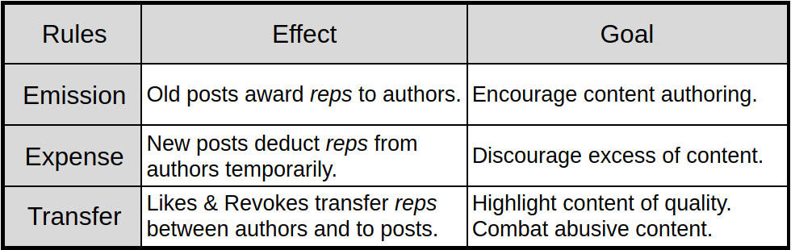
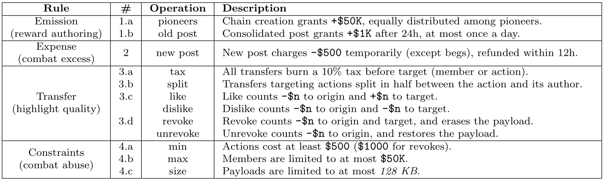

# Freechains: Reputation System

<!--
https://docs.google.com/spreadsheets/d/1K9vqrDHXvDQdqdGE7h-y1Bp_Phwt3CszXyGP962Wpsk/edit?gid=1850503300#gid=1850503300
-->

[
    [Rules](#rules)               |
    [Design Goals](#design-goals)
]

In the absence of moderation, permissionless peer-to-peer public forums are
impractical, mostly because of Sybil attacks.
For instance, it should take a few seconds to generate thousands of fake
identities and SPAM millions of messages into the system.
The reputation system of Freechains works together with a
[consensus mechanism](guide.md#consensus) to mitigate Sybil attacks and make
peer-to-peer public forums practical.

Each chain is controlled by an autonomous reputation system that receives input
from members (authors) based on likes and dislikes to posts.
The reputation system tracks the reputation of posts and authors in the chain.
Each chain is independent, so the reputation of a given author may vary across
chains.
The unit of reputation is known as ***rep*** and can be created, spent, and
transferred.

Members spend reps to post and rate content in the forums:
    a ***post*** temporarily penalizes its author until it consolidates and counts positively;
    a ***like*** is a positive feedback to distinguish good content amid excess;
    a ***dislike*** is a negative feedback to drain reputation from bad content;
    a ***revoke*** is an explicit vote to hide abusive content from the chain.

## Rules

The concrete rules are as follows:

- ***Rule 1.a*** bootstraps a chain, assigning *50000 reps* equally distributed
  among the pioneers referred in the public keys.
  The pioneers shape the initial culture of the chain with their first posts
  and likes.
- ***Rule 1.b*** awards authors of new posts with *1000 reps*, but only after
  24 hours, and at most once per day per author.
  This rule stimulates content creation and grows the economy of chains.
  The 24-hour period gives sufficient time for other members to judge the post
  before awarding the author.
  It also regulates the growth speed of the chain.
- ***Rule 2*** imposes a temporary cost of *500 reps* for each new post.
  The cost period varies from 0 to 12 hours, depending on the activity
  succeeding (and including) the new post.
  The more activity from reputed authors, the less time the discount persists.
- ***Rule 3*** for "votes" (likes and revokes) serves three purposes:
    (i) welcoming new members,
    (ii) measuring the quality of posts, and
    (iii) penalizing abuse (SPAM, fake news, illegal content, etc).
    - ***Rule 3.a*** for *likes* and *dislikes* rates posts and authors.
      A like targeting a post transfers reps from the caster to the post and to
      its author, half each; a like targeting an author transfers the whole
      amount.
      A dislike drains the same amounts instead.
      Every transfer burns a *10% tax*, which prevents reputation cycling
      exploits.
    - ***Rule 3.b*** for *revokes* and *unrevokes* hides and restores abusive
      payloads.
      A post is revoked when the reps-weighted sum of revokes outweighs the
      unrevokes.
      As the "right to be forgotten", authors may also revoke their own posts,
      for free and regardless of the community votes.
- ***Rule 4.a*** imposes that authors afford the full cost of each act,
  effectively blocking Sybil actions.
  Note that ***Rule 1.a*** solves the chicken-and-egg problem imposed by this
  rule.
  Note also that outsiders can still *beg*: a begging post is parked apart from
  the chain until an insider funds it with a like.
- ***Rule 4.b*** limits authors to at most *50000 reps*, which provides
  incentives to spend likes and thus decentralize the network.
- ***Rule 4.c*** limits the size of posts to at most *128 KB* to prevent DDoS
  attacks using gigantic posts.

## Design Goals

The reputation system of Freechains aims to preserve the quality of posts in a
chain along with fairness among its authors.

The quality of posts is subjective and is up to members to judge them with
likes, dislikes, revokes, or simply abstaining.
A member can revoke malicious posts, when considering them offensive, SPAM,
fake, illegal, or even for disagreement.
On the one hand, since votes are finite, members have to ponder before spending
them.
On the other hand, since reputation is limited to at most *50000 reps*, members
also have incentives to cooperate with the quality of the chain.
The contents of a post can be erased through explicit revoke votes, weighted by
the reps spent on them.
This mechanism is not intended to eliminate disagreements of opinion, but only
to ban malicious members (e.g. a *troll*, *spammer*, or *abuser*).
The excess of dislikes and revokes not only penalizes a post, but also consumes
the reputation of its author to the point that s/he cannot post again.

We consider that in a fair chain, members have equal opportunities to speak, or
at least that the amount of noise is limited.
Freechains restricts the number of posts in two ways: first, new posts penalize
authors for up to 12 hours; second, at most one post per day can generate
reputation for an author.
The first rule prevents that an author posts too many messages in sequence at
the cost of decreasing its reputation very fast.
The second rule limits the amount of reputation the member can collect over
time, which also affects the frequency in which members post.
These rules mostly apply to neutral posts that do not receive much attention
from other members with likes and dislikes.
However, if a given author receives a lot of likes, it means that other members
are conceding their own voices to the author.
Similarly, a dislike means that other members are conceding their own voices to
mute the author.

The bootstrap of chains is also a situation that deserves clarification.
At the beginning, only the chain pioneers have reputation.
Since new posts require previous reputation, no other authors can post in the
chain unless a pioneer welcomes them with likes.
After some time, other authors build up reputation on their own and can welcome
newcomers themselves.
However, the pioneers can still interfere early in the process with enough
dislikes to clear someone else's reputation at the point of banishment.
The early dynamics of a chain determines how the community evolves, since new
members can inspect the actions of the pioneers and other authors that emerge
with reputation.
Ultimately, members can always recreate or join chains that better adhere to
their principles.

The size of the "economy" of each chain is its amount of consolidated posts.
Likes and dislikes only transfer reputation between authors, and the initial
reputation of the pioneers becomes negligible as time goes.
The number of accountable consolidated posts is also limited to at most one per
day per author.
Hence, the size of the economy highly depends on the number of active authors
in the chain.
This mechanism creates incentives to welcome new members to participate and
post in the chain.
In contrast, this mechanism also disincentives authors to dislike posts, since
they drain nearly twice the amount into the void.
On the one hand, we believe that this fact contributes to sustain healthy
discussions with a reasonable degree of disagreement, otherwise the economy of
chains would collapse with an outbreak of dislikes.
On the other hand, obvious undesired content like SPAM is rapidly erased (along
with its author's reputation) with a few revokes that do not affect the chain
economy.
